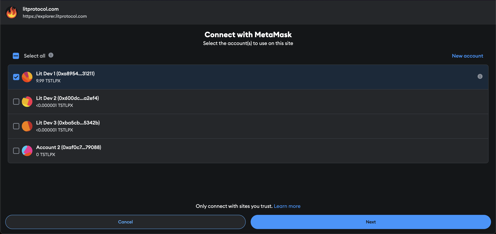

# Via the Lit Explorer

Capacity Credits can be minted using the [Lit Explorer](https://explorer.litprotocol.com/) dApp. The following guide will demonstrate how to mint a new Capacity Credit.

:::info
To learn more about what a Capacity Credit is, and how they're used, please go [here](../capacity-credit-intro.md).
:::

## Prerequisites

Before continuing, you'll need access to an Ethereum wallet that has [Lit test tokens](../../connecting-to-a-lit-network/lit-blockchains/chronicle-yellowstone.md#tstlpx-test-token) on the Chronicle Yellowstone blockchain. If you don't already have tokens, you can request some using [the faucet](https://chronicle-yellowstone-faucet.getlit.dev/). The `tstLPX` test token will be sent to your wallet address, allowing you to perform transactions on the rollup.

You'll also need to add the Chronicle Yellowstone [chain facts](../../connecting-to-a-lit-network/lit-blockchains/chronicle-yellowstone.md#connecting-to-chronicle-yellowstone) to your wallet, so that you can send transaction to the network.

## Setup

1. Navigate to the [Lit Explorer](https://explorer.litprotocol.com/) dApp.

2. Connect your wallet to the explorer by clicking the `Connect Wallet` button.

3. Select the Lit network you'd like to mint the Capacity Credit for.

This is done using the network dropdown next to the previously clicked `Connect Wallet` button. By default, the `Datil` network is selected - the Datil network is the decentralized mainnet bet Lit network. For an overview of the available Lit networks, go [here](../../connecting-to-a-lit-network/testnets.md)
